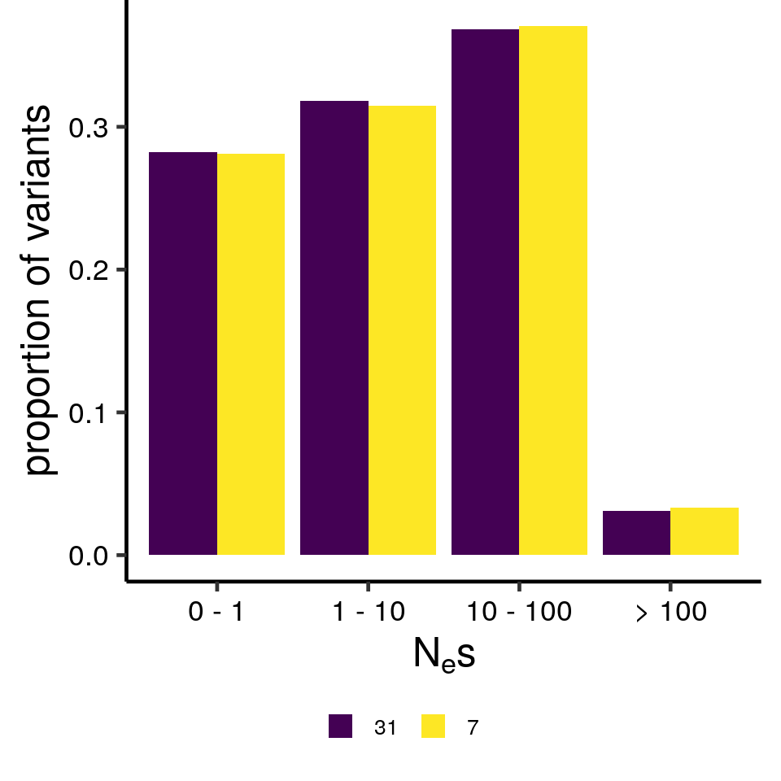

# 0fold DFE using individuals over 10X

I re-estimated the 0-fold DFE using the highest coverage individuals in the dataset (7 fish with >10X coverage), to see
if the overall low coverage of the main dataset is problematic. Results are essentially the same. Though 13X is still 
on the lower end of desirable.

Subsetting VCF to 7 individuals with coverage over 10X, mean coverage 13X.
   
 ```shell script
mkdir /scratch/project_2002047/barson_reseq/higher_cov
gatk SelectVariants -R /scratch/project_2002047/sal_reseq_v_mapping/bams/Reference_genome_with_SDY/GCF_000233375.1_ICSASG_v2_genomic_with_SDY.fna -V /scratch/project_2002047/barson_reseq/post_vqsr/salsal_31.autosomes.t99_5_snps.allfilters.polarised.vcf.gz -O /scratch/project_2002047/barson_reseq/higher_cov/salsal_7.autosomes.t99_5_snps.allfilters.polarised.vcf.gz --sample-name samples_10x.args --exclude-non-variants
zgrep -v ID=NW /scratch/project_2002047/barson_reseq/higher_cov/salsal_7.autosomes.t99_5_snps.allfilters.polarised.vcf.gz | bgzip -c > /scratch/project_2002047/barson_reseq/higher_cov/salsal_7.autosomes.t99_5_snps.allfilters.polarised.trim_head.vcf.gz
tabix -pvcf /scratch/project_2002047/barson_reseq/higher_cov/salsal_7.autosomes.t99_5_snps.allfilters.polarised.trim_head.vcf.gz
```

0fold and 4fold SFS

```shell script
mkdir /scratch/project_2002047/barson_reseq/higher_cov/sfs/

python ../sfs/chromosomal_bootstrap_sfs_data.py -bed_regs /scratch/tuyida/bartonhe/sal_ref/GCF_000233375.1_ICSASG_v2_gene_names.bed.gz -bed_target /scratch/tuyida/bartonhe/sal_ref/salmo_salar_0fold.bed.gz -vcf /scratch/project_2002047/barson_reseq/higher_cov/salsal_7.autosomes.t99_5_snps.allfilters.polarised.trim_head.vcf.gz -call_fa /scratch/project_2002047/barson_reseq/callable_sites/salsal_31.callable.fa -region 0fold -chromo_list /scratch/tuyida/bartonhe/sal_ref/autosomes_list.txt -out_dir /scratch/project_2002047/barson_reseq/higher_cov/sfs/
head -n 1 /scratch/project_2002047/barson_reseq/higher_cov/sfs/sfs_ncall_regional.0fold.NC_027300.1.txt > /scratch/project_2002047/barson_reseq/higher_cov/sfs/sfs_ncall_regional.0fold.all.txt
cat /scratch/project_2002047/barson_reseq/higher_cov/sfs/sfs_ncall_regional.0fold.NC*.1.txt | grep -v ^region >> /scratch/project_2002047/barson_reseq/higher_cov/sfs/sfs_ncall_regional.0fold.all.txt

python ../sfs/chromosomal_bootstrap_sfs_data.py -bed_regs /scratch/tuyida/bartonhe/sal_ref/GCF_000233375.1_ICSASG_v2_gene_names.bed.gz -bed_target /scratch/tuyida/bartonhe/sal_ref/salmo_salar_4fold.bed.gz -vcf /scratch/project_2002047/barson_reseq/higher_cov/salsal_7.autosomes.t99_5_snps.allfilters.polarised.trim_head.vcf.gz -call_fa /scratch/project_2002047/barson_reseq/callable_sites/salsal_31.callable.fa -region 4fold -chromo_list /scratch/tuyida/bartonhe/sal_ref/autosomes_list.txt -out_dir /scratch/project_2002047/barson_reseq/higher_cov/sfs/
head -n 1 /scratch/project_2002047/barson_reseq/higher_cov/sfs/sfs_ncall_regional.4fold.NC_027300.1.txt > /scratch/project_2002047/barson_reseq/higher_cov/sfs/sfs_ncall_regional.4fold.all.txt
cat /scratch/project_2002047/barson_reseq/higher_cov/sfs/sfs_ncall_regional.4fold.NC*.1.txt | grep -v ^region >> /scratch/project_2002047/barson_reseq/higher_cov/sfs/sfs_ncall_regional.4fold.all.txt
```

DFE

```shell script
python ../sfs/prep_anavar_data.py -sfs_ref /scratch/project_2002047/barson_reseq/higher_cov/sfs/sfs_ncall_regional.4fold.all.txt -sfs_target /scratch/project_2002047/barson_reseq/higher_cov/sfs/sfs_ncall_regional.0fold.all.txt -bs_rep 0 -n 7 > 0fold_sfs_data_salsal7.txt

mkdir /scratch/project_2002047/barson_reseq/higher_cov/dfe/
cat 0fold_sfs_data_salsal7.txt | python ../dfe/enhancer_dfe.py -n 14 -c 1 -dfe continuous -out_pre /scratch/project_2002047/barson_reseq/higher_cov/dfe/ss7_0fold_4fold_continuous_equal_t -constraint equal_mutation_rate -n_search 1000
ls /scratch/project_2002047/barson_reseq/higher_cov/dfe/*results.txt | python ../dfe/gather_bs_reps.py > salsal7_0fold_gamma-dfe_0bs.csv
ls salsal7_0fold_gamma-dfe_0bs.csv | python ../dfe/bin_dfe.py > binned_dfe_ss7_0fold.csv
```

