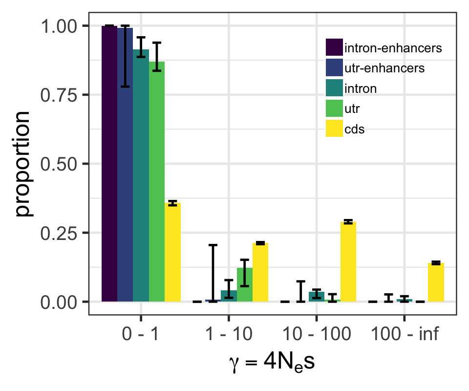

# Estimating the DFE from the unfolded SNP SFS

I fitted a model with a gamma distributed DFE to the intronic, utr and cds uSFS with 4fold SNPs as reference. Mutation 
rates were assumed to be equal between neutral and selected sites. Runs were bootstrapped 100 times, through resampling 
and replacement by gene.


Anavar was run for each region to determine best fit model:

## 0 fold degenerate
```shell script
mkdir /scratch/project_2002047/sal_enhance/0fold_dfe

```

## CDS regions

```shell script
mkdir /scratch/project_2002047/sal_enhance/cds_dfe
cat ../sfs/cds_sfs_data.txt | python enhancer_dfe.py -n 62 -c 1 -dfe continuous -out_pre /scratch/project_2002047/sal_enhance/cds_dfe/ss_cds_4fold_continuous_equal_t -constraint equal_mutation_rate -n_search 1000
ls /scratch/project_2002047/sal_enhance/cds_dfe/*results.txt | python gather_bs_reps.py > salsal31_cds_gamma-dfe_100bs.csv
```

## UTR

```shell script
mkdir /scratch/project_2002047/sal_enhance/utr_dfe
cat ../sfs/utr_sfs_data.txt | python enhancer_dfe.py -n 62 -c 1 -dfe continuous -out_pre /scratch/project_2002047/sal_enhance/utr_dfe/ss_utr_4fold_continuous_equal_t -constraint equal_mutation_rate -n_search 1000
ls /scratch/project_2002047/sal_enhance/utr_dfe/*results.txt | python gather_bs_reps.py > salsal31_utr_gamma-dfe_100bs.csv
```

## Introns

```shell script
mkdir /scratch/project_2002047/sal_enhance/intron_dfe 
cat ../sfs/intron_sfs_data.txt | python enhancer_dfe.py -n 62 -c 1 -dfe continuous -out_pre /scratch/project_2002047/sal_enhance/intron_dfe/ss_intron_4fold_continuous_equal_t -constraint equal_mutation_rate -n_search 1000
ls /scratch/project_2002047/sal_enhance/intron_dfe/*results.txt | python gather_bs_reps.py > salsal31_intron_gamma-dfe_100bs.csv
```

## Intergenic

```shell script
mkdir /scratch/project_2002047/sal_enhance/intergenic_dfe 
cat ../sfs/intergenic_sfs_data.txt | python enhancer_dfe.py -n 62 -c 1 -dfe continuous -out_pre /scratch/project_2002047/sal_enhance/intergenic_dfe/ss_intergenic_4fold_continuous_equal_t -constraint equal_mutation_rate -n_search 1000
ls /scratch/project_2002047/sal_enhance/intergenic_dfe/*results.txt | python gather_bs_reps.py > salsal31_intergenic_gamma-dfe_100bs.csv
```

## Peaks (all)

```shell script
mkdir /scratch/project_2002047/sal_enhance/all_enhancers_dfe
cat ../sfs/all_enhancers_sfs_data.txt | python enhancer_dfe.py -n 62 -c 1 -dfe continuous -out_pre /scratch/project_2002047/sal_enhance/all_enhancers_dfe/ss_all-enhancers_4fold_continuous_equal_t -constraint equal_mutation_rate -n_search 1000
ls /scratch/project_2002047/sal_enhance/all_enhancers_dfe/*results.txt | python gather_bs_reps.py > salsal31_all-enhancers_gamma-dfe_100bs.csv
```

## Peaks (CDS)

```shell script
mkdir /scratch/project_2002047/sal_enhance/cds_enhancers_dfe  
cat ../sfs/cds_enhancers_sfs_data.txt | python enhancer_dfe.py -n 62 -c 1 -dfe continuous -out_pre /scratch/project_2002047/sal_enhance/cds_enhancers_dfe/ss_cds-enhancers_4fold_continuous_equal_t -constraint equal_mutation_rate -n_search 1000
# 5 jobs failed: todo
ll /scratch/project_2002047/sal_enhance/cds_enhancers_dfe/*error |  grep -w 0 | tr -s ' ' | cut -d ' ' -f 9 | cut -d '.' -f 1-3 | while read i; do echo $i.results.txt; done | python gather_bs_reps.py > salsal31_cds-enhancers_gamma-dfe_100bs.csv
```

## Peaks (UTR)

```shell script
mkdir /scratch/project_2002047/sal_enhance/utr_enhancers_dfe 
cat ../sfs/utr_enhancers_sfs_data.txt | python enhancer_dfe.py -n 62 -c 1 -dfe continuous -out_pre /scratch/project_2002047/sal_enhance/utr_enhancers_dfe/ss_utr-enhancers_4fold_continuous_equal_t -constraint equal_mutation_rate -n_search 1000
# 4 jobs failed: todo
ll /scratch/project_2002047/sal_enhance/utr_enhancers_dfe/*error | grep -vw 0 | tr -s ' ' | cut -d ' ' -f 9 | cut -d '.' -f 1-3 | while read i; do sbatch $i.sh; done
ll /scratch/project_2002047/sal_enhance/utr_enhancers_dfe/*error | grep -w 0 | tr -s ' ' | cut -d ' ' -f 9 | cut -d '.' -f 1-3 | while read i; do echo $i.results.txt; done | python gather_bs_reps.py > salsal31_utr-enhancers_gamma-dfe_100bs.csv
```

## Peaks (introns)

```shell script
mkdir /scratch/project_2002047/sal_enhance/intron_enhancers_dfe 
cat ../sfs/intron_enhancers_sfs_data.txt | python enhancer_dfe.py -n 62 -c 1 -dfe continuous -out_pre /scratch/project_2002047/sal_enhance/intron_enhancers_dfe/ss_intron-enhancers_4fold_continuous_equal_t -constraint equal_mutation_rate -n_search 1000
ls /scratch/project_2002047/sal_enhance/intron_enhancers_dfe/*results.txt | python gather_bs_reps.py > salsal31_intron-enhancers_gamma-dfe_100bs.csv
```

## Peaks (intergenic)

```shell script
mkdir /scratch/project_2002047/sal_enhance/intergenic_enhancers_dfe 
cat ../sfs/intergenic_enhancers_sfs_data.txt | python enhancer_dfe.py -n 62 -c 1 -dfe continuous -out_pre /scratch/project_2002047/sal_enhance/intergenic_enhancers_dfe/ss_intergenic-enhancers_4fold_continuous_equal_t -constraint equal_mutation_rate -n_search 1000
ls /scratch/project_2002047/sal_enhance/intergenic_enhancers_dfe/*results.txt | python gather_bs_reps.py > salsal31_intergenic-enhancers_gamma-dfe_100bs.csv
```

Estimated DFEs were binned into selective categories and 95% confidence intervals calculated:

```shell script
ls salsal31_*_gamma-dfe_100bs.csv | python bin_dfe.py > binned_dfe_allregions.csv
ls salsal31_*_gamma-dfe_100bs.csv | python bin_dfe.py > binned_gammadfe_allregions_nes_5bin.csv
Rscript summarise_dfe.R
```



<!---
head -n 2 ../sfs/cds_sfs_data.txt | python enhancer_dfe.py -n 62 -c 1 -dfe discrete -out_pre /scratch/project_2002047/sal_enhance/cds_dfe/ss_cds_4fold_1class_equal_t -constraint equal_mutation_rate -n_search 1000
head -n 2 ../sfs/cds_sfs_data.txt | python enhancer_dfe.py -n 62 -c 2 -dfe discrete -out_pre /scratch/project_2002047/sal_enhance/cds_dfe/ss_cds_4fold_2class_equal_t -constraint equal_mutation_rate -n_search 1000
head -n 2 ../sfs/cds_sfs_data.txt | python enhancer_dfe.py -n 62 -c 3 -dfe discrete -out_pre /scratch/project_2002047/sal_enhance/cds_dfe/ss_cds_4fold_3class_equal_t -constraint equal_mutation_rate -n_search 1000
head -n 2 ../sfs/cds_sfs_data.txt | python enhancer_dfe.py -n 62 -c 4 -dfe discrete -out_pre /scratch/project_2002047/sal_enhance/cds_dfe/ss_cds_4fold_4class_equal_t -constraint equal_mutation_rate -n_search 1000

ls /scratch/project_2002047/sal_enhance/cds_dfe/ss_cds_4fold_*bsrep0.split1.results.txt | python process_anavar_results.py -dn 0.009020994 -ds 0.01805807 > ss31_cds_mles.csv

head -n 2 ../sfs/utr_sfs_data.txt | python enhancer_dfe.py -n 62 -c 1 -dfe discrete -out_pre /scratch/project_2002047/sal_enhance/utr_dfe/ss_utr_4fold_1class_equal_t -constraint equal_mutation_rate -n_search 1000
head -n 2 ../sfs/utr_sfs_data.txt | python enhancer_dfe.py -n 62 -c 2 -dfe discrete -out_pre /scratch/project_2002047/sal_enhance/utr_dfe/ss_utr_4fold_2class_equal_t -constraint equal_mutation_rate -n_search 1000
head -n 2 ../sfs/utr_sfs_data.txt | python enhancer_dfe.py -n 62 -c 3 -dfe discrete -out_pre /scratch/project_2002047/sal_enhance/utr_dfe/ss_utr_4fold_3class_equal_t -constraint equal_mutation_rate -n_search 1000
head -n 2 ../sfs/utr_sfs_data.txt | python enhancer_dfe.py -n 62 -c 4 -dfe discrete -out_pre /scratch/project_2002047/sal_enhance/utr_dfe/ss_utr_4fold_4class_equal_t -constraint equal_mutation_rate -n_search 1000

ls /scratch/project_2002047/sal_enhance/utr_dfe/ss_utr_4fold_*bsrep0.split1.results.txt | python process_anavar_results.py -dn 0.01152652 -ds 0.01805807 > ss31_utr_mles.csv

head -n 2 ../sfs/intron_sfs_data.txt | python enhancer_dfe.py -n 62 -c 1 -dfe discrete -out_pre /scratch/project_2002047/sal_enhance/intron_dfe/ss_intron_4fold_1class_equal_t -constraint equal_mutation_rate -n_search 1000
head -n 2 ../sfs/intron_sfs_data.txt | python enhancer_dfe.py -n 62 -c 2 -dfe discrete -out_pre /scratch/project_2002047/sal_enhance/intron_dfe/ss_intron_4fold_2class_equal_t -constraint equal_mutation_rate -n_search 1000
head -n 2 ../sfs/intron_sfs_data.txt | python enhancer_dfe.py -n 62 -c 3 -dfe discrete -out_pre /scratch/project_2002047/sal_enhance/intron_dfe/ss_intron_4fold_3class_equal_t -constraint equal_mutation_rate -n_search 1000
head -n 2 ../sfs/intron_sfs_data.txt | python enhancer_dfe.py -n 62 -c 4 -dfe discrete -out_pre /scratch/project_2002047/sal_enhance/intron_dfe/ss_intron_4fold_4class_equal_t -constraint equal_mutation_rate -n_search 1000

ls /scratch/project_2002047/sal_enhance/intron_dfe/ss_intron_4fold_*bsrep0.split1.results.txt | python process_anavar_results.py -dn 0.01354097 -ds 0.01805807 > ss31_intron_mles.csv

head -n 2 ../sfs/intergenic_sfs_data.txt | python enhancer_dfe.py -n 62 -c 1 -dfe discrete -out_pre /scratch/project_2002047/sal_enhance/intergenic_dfe/ss_intergenic_4fold_1class_equal_t -constraint equal_mutation_rate -n_search 1000
head -n 2 ../sfs/intergenic_sfs_data.txt | python enhancer_dfe.py -n 62 -c 2 -dfe discrete -out_pre /scratch/project_2002047/sal_enhance/intergenic_dfe/ss_intergenic_4fold_2class_equal_t -constraint equal_mutation_rate -n_search 1000
head -n 2 ../sfs/intergenic_sfs_data.txt | python enhancer_dfe.py -n 62 -c 3 -dfe discrete -out_pre /scratch/project_2002047/sal_enhance/intergenic_dfe/ss_intergenic_4fold_3class_equal_t -constraint equal_mutation_rate -n_search 1000
head -n 2 ../sfs/intergenic_sfs_data.txt | python enhancer_dfe.py -n 62 -c 4 -dfe discrete -out_pre /scratch/project_2002047/sal_enhance/intergenic_dfe/ss_intergenic_4fold_4class_equal_t -constraint equal_mutation_rate -n_search 1000

ls /scratch/project_2002047/sal_enhance/intergenic_dfe/ss_intergenic_4fold_*bsrep0.split1.results.txt | python process_anavar_results.py -dn 0.01502859 -ds 0.01805807 > ss31_intergenic_mles.csv

head -n 2 ../sfs/all_enhancers_sfs_data.txt | python enhancer_dfe.py -n 62 -c 1 -dfe discrete -out_pre /scratch/project_2002047/sal_enhance/all_enhancers_dfe/ss_all-enhancers_4fold_1class_equal_t -constraint equal_mutation_rate -n_search 1000
head -n 2 ../sfs/all_enhancers_sfs_data.txt | python enhancer_dfe.py -n 62 -c 2 -dfe discrete -out_pre /scratch/project_2002047/sal_enhance/all_enhancers_dfe/ss_all-enhancers_4fold_2class_equal_t -constraint equal_mutation_rate -n_search 1000
head -n 2 ../sfs/all_enhancers_sfs_data.txt | python enhancer_dfe.py -n 62 -c 3 -dfe discrete -out_pre /scratch/project_2002047/sal_enhance/all_enhancers_dfe/ss_all-enhancers_4fold_3class_equal_t -constraint equal_mutation_rate -n_search 1000
head -n 2 ../sfs/all_enhancers_sfs_data.txt | python enhancer_dfe.py -n 62 -c 4 -dfe discrete -out_pre /scratch/project_2002047/sal_enhance/all_enhancers_dfe/ss_all-enhancers_4fold_4class_equal_t -constraint equal_mutation_rate -n_search 1000

ls /scratch/project_2002047/sal_enhance/all_enhancers_dfe/ss_all-enhancers_4fold_*bsrep0.split1.results.txt | python process_anavar_results.py -dn 0.01199041 -ds 0.01805807 > ss31_all-enhancers_mles.csv

head -n 2 ../sfs/cds_enhancers_sfs_data.txt | python enhancer_dfe.py -n 62 -c 1 -dfe discrete -out_pre /scratch/project_2002047/sal_enhance/cds_enhancers_dfe/ss_cds-enhancers_4fold_1class_equal_t -constraint equal_mutation_rate -n_search 1000
head -n 2 ../sfs/cds_enhancers_sfs_data.txt | python enhancer_dfe.py -n 62 -c 2 -dfe discrete -out_pre /scratch/project_2002047/sal_enhance/cds_enhancers_dfe/ss_cds-enhancers_4fold_2class_equal_t -constraint equal_mutation_rate -n_search 1000
head -n 2 ../sfs/cds_enhancers_sfs_data.txt | python enhancer_dfe.py -n 62 -c 3 -dfe discrete -out_pre /scratch/project_2002047/sal_enhance/cds_enhancers_dfe/ss_cds-enhancers_4fold_3class_equal_t -constraint equal_mutation_rate -n_search 1000
head -n 2 ../sfs/cds_enhancers_sfs_data.txt | python enhancer_dfe.py -n 62 -c 4 -dfe discrete -out_pre /scratch/project_2002047/sal_enhance/cds_enhancers_dfe/ss_cds-enhancers_4fold_4class_equal_t -constraint equal_mutation_rate -n_search 1000

ls /scratch/project_2002047/sal_enhance/cds_enhancers_dfe/ss_cds-enhancers_4fold_*bsrep0.split1.results.txt | python process_anavar_results.py -dn 0.007779776 -ds 0.01805807 > ss31_cds-enhancers_mles.csv

head -n 2 ../sfs/utr_enhancers_sfs_data.txt | python enhancer_dfe.py -n 62 -c 1 -dfe discrete -out_pre /scratch/project_2002047/sal_enhance/utr_enhancers_dfe/ss_utr-enhancers_4fold_1class_equal_t -constraint equal_mutation_rate -n_search 1000
head -n 2 ../sfs/utr_enhancers_sfs_data.txt | python enhancer_dfe.py -n 62 -c 2 -dfe discrete -out_pre /scratch/project_2002047/sal_enhance/utr_enhancers_dfe/ss_utr-enhancers_4fold_2class_equal_t -constraint equal_mutation_rate -n_search 1000
head -n 2 ../sfs/utr_enhancers_sfs_data.txt | python enhancer_dfe.py -n 62 -c 3 -dfe discrete -out_pre /scratch/project_2002047/sal_enhance/utr_enhancers_dfe/ss_utr-enhancers_4fold_3class_equal_t -constraint equal_mutation_rate -n_search 1000
head -n 2 ../sfs/utr_enhancers_sfs_data.txt | python enhancer_dfe.py -n 62 -c 4 -dfe discrete -out_pre /scratch/project_2002047/sal_enhance/utr_enhancers_dfe/ss_utr-enhancers_4fold_4class_equal_t -constraint equal_mutation_rate -n_search 1000

head -n 2 ../sfs/intron_enhancers_sfs_data.txt | python enhancer_dfe.py -n 62 -c 1 -dfe discrete -out_pre /scratch/project_2002047/sal_enhance/intron_enhancers_dfe/ss_intron-enhancers_4fold_1class_equal_t -constraint equal_mutation_rate -n_search 1000
head -n 2 ../sfs/intron_enhancers_sfs_data.txt | python enhancer_dfe.py -n 62 -c 2 -dfe discrete -out_pre /scratch/project_2002047/sal_enhance/intron_enhancers_dfe/ss_intron-enhancers_4fold_2class_equal_t -constraint equal_mutation_rate -n_search 1000
head -n 2 ../sfs/intron_enhancers_sfs_data.txt | python enhancer_dfe.py -n 62 -c 3 -dfe discrete -out_pre /scratch/project_2002047/sal_enhance/intron_enhancers_dfe/ss_intron-enhancers_4fold_3class_equal_t -constraint equal_mutation_rate -n_search 1000
head -n 2 ../sfs/intron_enhancers_sfs_data.txt | python enhancer_dfe.py -n 62 -c 4 -dfe discrete -out_pre /scratch/project_2002047/sal_enhance/intron_enhancers_dfe/ss_intron-enhancers_4fold_4class_equal_t -constraint equal_mutation_rate -n_search 1000

head -n 2 ../sfs/intergenic_enhancers_sfs_data.txt | python enhancer_dfe.py -n 62 -c 1 -dfe discrete -out_pre /scratch/project_2002047/sal_enhance/intergenic_enhancers_dfe/ss_intergenic-enhancers_4fold_1class_equal_t -constraint equal_mutation_rate -n_search 1000
head -n 2 ../sfs/intergenic_enhancers_sfs_data.txt | python enhancer_dfe.py -n 62 -c 2 -dfe discrete -out_pre /scratch/project_2002047/sal_enhance/intergenic_enhancers_dfe/ss_intergenic-enhancers_4fold_2class_equal_t -constraint equal_mutation_rate -n_search 1000
head -n 2 ../sfs/intergenic_enhancers_sfs_data.txt | python enhancer_dfe.py -n 62 -c 3 -dfe discrete -out_pre /scratch/project_2002047/sal_enhance/intergenic_enhancers_dfe/ss_intergenic-enhancers_4fold_3class_equal_t -constraint equal_mutation_rate -n_search 1000
head -n 2 ../sfs/intergenic_enhancers_sfs_data.txt | python enhancer_dfe.py -n 62 -c 4 -dfe discrete -out_pre /scratch/project_2002047/sal_enhance/intergenic_enhancers_dfe/ss_intergenic-enhancers_4fold_4class_equal_t -constraint equal_mutation_rate -n_search 1000


--->