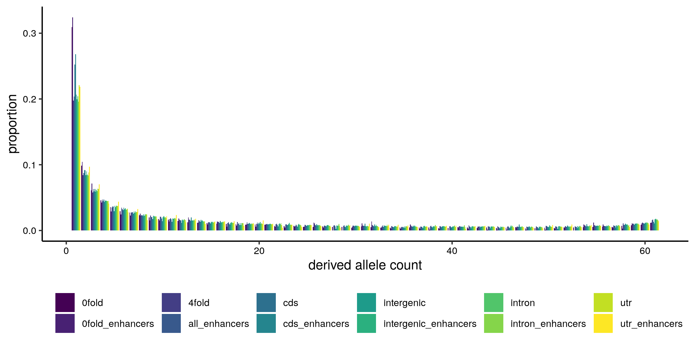

# Generating site frequency spectra

For 4fold sites, CDS, UTRs, introns.

```shell script
mkdir /scratch/project_2002047/sal_enhance/sfs

python chromosomal_bootstrap_sfs_data.py -bed_regs /scratch/tuyida/bartonhe/sal_ref/GCF_000233375.1_ICSASG_v2_gene_names.bed.gz -bed_target /scratch/tuyida/bartonhe/sal_ref/salmo_salar_4fold.bed.gz -vcf /scratch/project_2002047/barson_reseq/post_vqsr/salsal_31.autosomes.t99_5_snps.allfilters.polarised.vcf.gz -call_fa /scratch/project_2002047/barson_reseq/callable_sites/salsal_31.callable.fa -region 4fold -chromo_list /scratch/tuyida/bartonhe/sal_ref/autosomes_list.txt -out_dir /scratch/project_2002047/sal_enhance/sfs/ 
head -n 1 /scratch/project_2002047/sal_enhance/sfs/sfs_ncall_regional.4fold.NC_027300.1.txt > /scratch/project_2002047/sal_enhance/sfs/sfs_ncall_regional.4fold.all.txt
cat /scratch/project_2002047/sal_enhance/sfs/sfs_ncall_regional.4fold.NC*.1.txt | grep -v ^region >> /scratch/project_2002047/sal_enhance/sfs/sfs_ncall_regional.4fold.all.txt

python chromosomal_bootstrap_sfs_data.py -bed_regs /scratch/tuyida/bartonhe/sal_ref/GCF_000233375.1_ICSASG_v2_gene_names.bed.gz -bed_target /scratch/tuyida/bartonhe/sal_ref/GCF_000233375.1_ICSASG_v2_cds.bed.gz -vcf /scratch/project_2002047/barson_reseq/post_vqsr/salsal_31.autosomes.t99_5_snps.allfilters.polarised.vcf.gz -call_fa /scratch/project_2002047/barson_reseq/callable_sites/salsal_31.callable.fa -region cds -chromo_list /scratch/tuyida/bartonhe/sal_ref/autosomes_list.txt -out_dir /scratch/project_2002047/sal_enhance/sfs/ 
head -n 1 /scratch/project_2002047/sal_enhance/sfs/sfs_ncall_regional.cds.NC_027300.1.txt > /scratch/project_2002047/sal_enhance/sfs/sfs_ncall_regional.cds.all.txt
cat /scratch/project_2002047/sal_enhance/sfs/sfs_ncall_regional.cds.NC_0273*1.txt | grep -v ^region >> /scratch/project_2002047/sal_enhance/sfs/sfs_ncall_regional.cds.all.txt

python chromosomal_bootstrap_sfs_data.py -bed_regs /scratch/tuyida/bartonhe/sal_ref/GCF_000233375.1_ICSASG_v2_gene_names.bed.gz -bed_target /scratch/tuyida/bartonhe/sal_ref/GCF_000233375.1_ICSASG_v2_utrs.bed.gz -vcf /scratch/project_2002047/barson_reseq/post_vqsr/salsal_31.autosomes.t99_5_snps.allfilters.polarised.vcf.gz -call_fa /scratch/project_2002047/barson_reseq/callable_sites/salsal_31.callable.fa -region utr -chromo_list /scratch/tuyida/bartonhe/sal_ref/autosomes_list.txt -out_dir /scratch/project_2002047/sal_enhance/sfs/ 
head -n 1 /scratch/project_2002047/sal_enhance/sfs/sfs_ncall_regional.utr.NC_027300.1.txt > /scratch/project_2002047/sal_enhance/sfs/sfs_ncall_regional.utr.all.txt
cat /scratch/project_2002047/sal_enhance/sfs/sfs_ncall_regional.utr.NC_0273*1.txt | grep -v ^region >> /scratch/project_2002047/sal_enhance/sfs/sfs_ncall_regional.utr.all.txt

python chromosomal_bootstrap_sfs_data.py -bed_regs /scratch/tuyida/bartonhe/sal_ref/GCF_000233375.1_ICSASG_v2_gene_names.bed.gz -bed_target /scratch/tuyida/bartonhe/sal_ref/GCF_000233375.1_ICSASG_v2_introns.bed.gz -vcf /scratch/project_2002047/barson_reseq/post_vqsr/salsal_31.autosomes.t99_5_snps.allfilters.polarised.vcf.gz -call_fa /scratch/project_2002047/barson_reseq/callable_sites/salsal_31.callable.fa -region intron -chromo_list /scratch/tuyida/bartonhe/sal_ref/autosomes_list.txt -out_dir /scratch/project_2002047/sal_enhance/sfs/ 
head -n 1 /scratch/project_2002047/sal_enhance/sfs/sfs_ncall_regional.intron.NC_027300.1.txt > /scratch/project_2002047/sal_enhance/sfs/sfs_ncall_regional.intron.all.txt
cat /scratch/project_2002047/sal_enhance/sfs/sfs_ncall_regional.intron.NC_0273*1.txt | grep -v ^region >> /scratch/project_2002047/sal_enhance/sfs/sfs_ncall_regional.intron.all.txt
```

For intergenic regions, the nearest gene (upstream, where possible) was identified and used for bootstrapping by gene, and sfs obtained.

```shell script
bedtools closest -t first -a /scratch/tuyida/bartonhe/sal_ref/GCF_000233375.1_ICSASG_v2_intergenic.bed.gz -b /scratch/tuyida/bartonhe/sal_ref/GCF_000233375.1_ICSASG_v2_gene_names.bed.gz | cut -f 1,2,3,7 | bgzip -c > /scratch/tuyida/bartonhe/sal_ref/GCF_000233375.1_ICSASG_v2_intergenic_nearestgene.bed.gz
tabix -pbed /scratch/tuyida/bartonhe/sal_ref/GCF_000233375.1_ICSASG_v2_intergenic_nearestgene.bed.gz

python chromosomal_bootstrap_sfs_data.py -bed_regs NA -bed_target /scratch/tuyida/bartonhe/sal_ref/GCF_000233375.1_ICSASG_v2_intergenic_nearestgene.bed.gz -vcf /scratch/project_2002047/barson_reseq/post_vqsr/salsal_31.autosomes.t99_5_snps.allfilters.polarised.vcf.gz -call_fa /scratch/project_2002047/barson_reseq/callable_sites/salsal_31.callable.fa -region intergenic -chromo_list /scratch/tuyida/bartonhe/sal_ref/autosomes_list.txt -out_dir /scratch/project_2002047/sal_enhance/sfs/
head -n 1 /scratch/project_2002047/sal_enhance/sfs/sfs_ncall_regional.intergenic.NC_027300.1.txt > /scratch/project_2002047/sal_enhance/sfs/sfs_ncall_regional.intergenic.all.txt
cat /scratch/project_2002047/sal_enhance/sfs/sfs_ncall_regional.intergenic.NC*.1.txt | grep -v ^region >> /scratch/project_2002047/sal_enhance/sfs/sfs_ncall_regional.intergenic.all.txt
```

For enhancers, the nearest gene was identified for each region (for bootstrapping by gene).

```shell script
cat filtered_outputPeaksGCnorm.bed | sort -k1,1 -k2,2n | cut -f1,2,3 | bgzip -c > enhancer_peaks.bed.gz
tabix -pbed enhancer_peaks.bed.gz 

bedtools closest -t first -a enhancer_peaks.bed.gz -b /scratch/tuyida/bartonhe/sal_ref/GCF_000233375.1_ICSASG_v2_gene_names.bed.gz | cut -f 1,2,3,7 | bgzip -c > enhancer_peaks_nearestgene.bed.gz
tabix -pbed enhancer_peaks_nearestgene.bed.gz
```

Then enhancers were subset into UTRs, intronic and intergenic:

```shell script
bedtools intersect -a enhancer_peaks_nearestgene.bed.gz -b /scratch/tuyida/bartonhe/sal_ref/GCF_000233375.1_ICSASG_v2_cds.bed.gz | sort -k1,1 -k2,2n | bgzip -c > enhancers_cds.bed.gz
bedtools intersect -a enhancer_peaks_nearestgene.bed.gz -b /scratch/tuyida/bartonhe/sal_ref/GCF_000233375.1_ICSASG_v2_utrs.bed.gz | sort -k1,1 -k2,2n | bgzip -c > enhancers_utr.bed.gz
bedtools intersect -a enhancer_peaks_nearestgene.bed.gz -b /scratch/tuyida/bartonhe/sal_ref/GCF_000233375.1_ICSASG_v2_introns.bed.gz | sort -k1,1 -k2,2n | bgzip -c > enhancers_intron.bed.gz
bedtools intersect -a enhancer_peaks_nearestgene.bed.gz -b /scratch/tuyida/bartonhe/sal_ref/GCF_000233375.1_ICSASG_v2_intergenic.bed.gz | sort -k1,1 -k2,2n | bgzip -c > enhancers_intergenic.bed.gz

ls enhancers_*.bed.gz | while read i; do tabix -pbed $i; done
```

Frequency data for enhancers was then generated:

```shell script
mkdir /scratch/project_2002047/sal_enhance/enhance_sfs

python chromosomal_bootstrap_sfs_data.py -bed_regs NA -bed_target enhancer_peaks_nearestgene.bed.gz -vcf /scratch/project_2002047/barson_reseq/post_vqsr/salsal_31.autosomes.t99_5_snps.allfilters.polarised.vcf.gz -call_fa /scratch/project_2002047/barson_reseq/callable_sites/salsal_31.callable.fa -region all_enhancers -chromo_list /scratch/tuyida/bartonhe/sal_ref/autosomes_list.txt -out_dir /scratch/project_2002047/sal_enhance/enhance_sfs/
head -n 1 /scratch/project_2002047/sal_enhance/enhance_sfs/sfs_ncall_regional.all_enhancers.NC_027300.1.txt > /scratch/project_2002047/sal_enhance/enhance_sfs/sfs_ncall_regional.all_enhancers.all.txt
cat /scratch/project_2002047/sal_enhance/enhance_sfs/sfs_ncall_regional.all_enhancers.NC*.1.txt | grep -v ^region >> /scratch/project_2002047/sal_enhance/enhance_sfs/sfs_ncall_regional.all_enhancers.all.txt

python chromosomal_bootstrap_sfs_data.py -bed_regs NA -bed_target enhancers_cds.bed.gz -vcf /scratch/project_2002047/barson_reseq/post_vqsr/salsal_31.autosomes.t99_5_snps.allfilters.polarised.vcf.gz -call_fa /scratch/project_2002047/barson_reseq/callable_sites/salsal_31.callable.fa -region cds_enhancers -chromo_list /scratch/tuyida/bartonhe/sal_ref/autosomes_list.txt -out_dir /scratch/project_2002047/sal_enhance/enhance_sfs/
head -n 1 /scratch/project_2002047/sal_enhance/enhance_sfs/sfs_ncall_regional.cds_enhancers.NC_027300.1.txt > /scratch/project_2002047/sal_enhance/enhance_sfs/sfs_ncall_regional.cds_enhancers.all.txt
cat /scratch/project_2002047/sal_enhance/enhance_sfs/sfs_ncall_regional.cds_enhancers.NC*.1.txt | grep -v ^region >> /scratch/project_2002047/sal_enhance/enhance_sfs/sfs_ncall_regional.cds_enhancers.all.txt

python chromosomal_bootstrap_sfs_data.py -bed_regs NA -bed_target enhancers_utr.bed.gz -vcf /scratch/project_2002047/barson_reseq/post_vqsr/salsal_31.autosomes.t99_5_snps.allfilters.polarised.vcf.gz -call_fa /scratch/project_2002047/barson_reseq/callable_sites/salsal_31.callable.fa -region utr_enhancers -chromo_list /scratch/tuyida/bartonhe/sal_ref/autosomes_list.txt -out_dir /scratch/project_2002047/sal_enhance/enhance_sfs/
head -n 1 /scratch/project_2002047/sal_enhance/enhance_sfs/sfs_ncall_regional.utr_enhancers.NC_027300.1.txt > /scratch/project_2002047/sal_enhance/enhance_sfs/sfs_ncall_regional.utr_enhancers.all.txt
cat /scratch/project_2002047/sal_enhance/enhance_sfs/sfs_ncall_regional.utr_enhancers.NC*.1.txt | grep -v ^region >> /scratch/project_2002047/sal_enhance/enhance_sfs/sfs_ncall_regional.utr_enhancers.all.txt

python chromosomal_bootstrap_sfs_data.py -bed_regs NA -bed_target enhancers_intron.bed.gz -vcf /scratch/project_2002047/barson_reseq/post_vqsr/salsal_31.autosomes.t99_5_snps.allfilters.polarised.vcf.gz -call_fa /scratch/project_2002047/barson_reseq/callable_sites/salsal_31.callable.fa -region utr_intron -chromo_list /scratch/tuyida/bartonhe/sal_ref/autosomes_list.txt -out_dir /scratch/project_2002047/sal_enhance/enhance_sfs/
head -n 1 /scratch/project_2002047/sal_enhance/enhance_sfs/sfs_ncall_regional.utr_intron.NC_027300.1.txt > /scratch/project_2002047/sal_enhance/enhance_sfs/sfs_ncall_regional.intron_enhancers.all.txt
cat /scratch/project_2002047/sal_enhance/enhance_sfs/sfs_ncall_regional.utr_intron.NC*.1.txt | grep -v ^region | sed 's/utr_intron/intron_enhancers/' >> /scratch/project_2002047/sal_enhance/enhance_sfs/sfs_ncall_regional.intron_enhancers.all.txt

python chromosomal_bootstrap_sfs_data.py -bed_regs NA -bed_target enhancers_intergenic.bed.gz -vcf /scratch/project_2002047/barson_reseq/post_vqsr/salsal_31.autosomes.t99_5_snps.allfilters.polarised.vcf.gz -call_fa /scratch/project_2002047/barson_reseq/callable_sites/salsal_31.callable.fa -region intergenic_enhancers -chromo_list /scratch/tuyida/bartonhe/sal_ref/autosomes_list.txt -out_dir /scratch/project_2002047/sal_enhance/enhance_sfs/
head -n 1 /scratch/project_2002047/sal_enhance/enhance_sfs/sfs_ncall_regional.intergenic_enhancers.NC_027300.1.txt > /scratch/project_2002047/sal_enhance/enhance_sfs/sfs_ncall_regional.intergenic_enhancers.all.txt
cat /scratch/project_2002047/sal_enhance/enhance_sfs/sfs_ncall_regional.intergenic_enhancers.NC*.1.txt | grep -v ^region >> /scratch/project_2002047/sal_enhance/enhance_sfs/sfs_ncall_regional.intergenic_enhancers.all.txt
```

SFS data was then prepared:

```shell script
python prep_anavar_data.py -sfs_ref /scratch/project_2002047/sal_enhance/sfs/sfs_ncall_regional.4fold.all.txt -sfs_target /scratch/project_2002047/sal_enhance/sfs/sfs_ncall_regional.4fold.all.txt -bs_rep 100 > 4fold_sfs_data.txt
python prep_anavar_data.py -sfs_ref /scratch/project_2002047/sal_enhance/sfs/sfs_ncall_regional.4fold.all.txt -sfs_target /scratch/project_2002047/sal_enhance/sfs/sfs_ncall_regional.cds.all.txt -bs_rep 100 > cds_sfs_data.txt
python prep_anavar_data.py -sfs_ref /scratch/project_2002047/sal_enhance/sfs/sfs_ncall_regional.4fold.all.txt -sfs_target /scratch/project_2002047/sal_enhance/sfs/sfs_ncall_regional.utr.all.txt -bs_rep 100 > utr_sfs_data.txt
python prep_anavar_data.py -sfs_ref /scratch/project_2002047/sal_enhance/sfs/sfs_ncall_regional.4fold.all.txt -sfs_target /scratch/project_2002047/sal_enhance/sfs/sfs_ncall_regional.intron.all.txt -bs_rep 100 > intron_sfs_data.txt
python prep_anavar_data.py -sfs_ref /scratch/project_2002047/sal_enhance/sfs/sfs_ncall_regional.4fold.all.txt -sfs_target /scratch/project_2002047/sal_enhance/sfs/sfs_ncall_regional.intergenic.all.txt -bs_rep 100 > intergenic_sfs_data.txt

python prep_anavar_data.py -sfs_ref /scratch/project_2002047/sal_enhance/sfs/sfs_ncall_regional.4fold.all.txt -sfs_target /scratch/project_2002047/sal_enhance/enhance_sfs/sfs_ncall_regional.all_enhancers.all.txt -bs_rep 100 > all_enhancers_sfs_data.txt
python prep_anavar_data.py -sfs_ref /scratch/project_2002047/sal_enhance/sfs/sfs_ncall_regional.4fold.all.txt -sfs_target /scratch/project_2002047/sal_enhance/enhance_sfs/sfs_ncall_regional.cds_enhancers.all.txt -bs_rep 100 > cds_enhancers_sfs_data.txt
python prep_anavar_data.py -sfs_ref /scratch/project_2002047/sal_enhance/sfs/sfs_ncall_regional.4fold.all.txt -sfs_target /scratch/project_2002047/sal_enhance/enhance_sfs/sfs_ncall_regional.utr_enhancers.all.txt -bs_rep 100 > utr_enhancers_sfs_data.txt
python prep_anavar_data.py -sfs_ref /scratch/project_2002047/sal_enhance/sfs/sfs_ncall_regional.4fold.all.txt -sfs_target /scratch/project_2002047/sal_enhance/enhance_sfs/sfs_ncall_regional.intron_enhancers.all.txt -bs_rep 100 > intron_enhancers_sfs_data.txt
python prep_anavar_data.py -sfs_ref /scratch/project_2002047/sal_enhance/sfs/sfs_ncall_regional.4fold.all.txt -sfs_target /scratch/project_2002047/sal_enhance/enhance_sfs/sfs_ncall_regional.intergenic_enhancers.all.txt -bs_rep 100 > intergenic_enhancers_sfs_data.txt
```

## Plotted SFS

```shell script
ls *sfs_data.txt | python longform_sfs.py > plottable_sfs.csv
Rscript sfs_plots.R 
```



# Comparing SFS from GATK pipeline with ANGSD SFS

Genomewise SFS from gatk pipeline

```shell script
~/sfs_utils/vcf2raw_sfs.py -vcf /scratch/project_2002047/barson_reseq/post_vqsr/salsal_31.autosomes.t99_5_snps.allfilters.polarised.vcf.gz -mode snp -folded | sort | uniq -c | tr -s ' ' | cut -d ' ' -f 2-3 > salsal31_sfs_folded_genomewide.txt
~/sfs_utils/vcf2raw_sfs.py -vcf /scratch/project_2002047/barson_reseq/t99.9_post_vqsr/salsal_31.autosomes.t99_9_snps.allfilters.vcf.gz -mode snp -folded | sort | uniq -c | tr -s ' ' | cut -d ' ' -f 2-3 > salsal31_sfs_folded_genomewide_t_99.txt
~/sfs_utils/vcf2raw_sfs.py -vcf /scratch/project_2002047/barson_reseq/t95.0_post_vqsr/salsal_31.autosomes.t95_0_snps.allfilters.vcf.gz -mode snp -folded | sort | uniq -c | tr -s ' ' | cut -d ' ' -f 2-3 > salsal31_sfs_folded_genomewide_t_95.txt

```

Genomwide SFS from bam files with angsd

```shell script
mkdir /scratch/project_2002047/barson_reseq/angsd_sfs_gl2_nobaq_mapq5_q10_depth2
ls /scratch/project_2002047/barson_mapping_v2/bqsr_bams/*bam > salsal31_bam_list.txt

sed 's/ /\t/g' /scratch/tuyida/bartonhe/sal_ref/GCF_000233375.1_ICSASG_v2_autosomes.bed | bgzip -c > /scratch/tuyida/bartonhe/sal_ref/GCF_000233375.1_ICSASG_v2_autosomes.bed.gz
tabix -pbed /scratch/tuyida/bartonhe/sal_ref/GCF_000233375.1_ICSASG_v2_autosomes.bed.gz
bedtools subtract -a /scratch/tuyida/bartonhe/sal_ref/GCF_000233375.1_ICSASG_v2_autosomes.bed.gz -b /scratch/tuyida/bartonhe/sal_ref/salmo_salar_repeats.bed.gz | bgzip -c > /scratch/tuyida/bartonhe/sal_ref/GCF_000233375.1_ICSASG_v2_nonrep.bed.gz
tabix -pbed /scratch/tuyida/bartonhe/sal_ref/GCF_000233375.1_ICSASG_v2_nonrep.bed.gz

python chromosomal_angsd.py -bam_list salsal31_bam_list.txt -ref /scratch/project_2002047/sal_reseq_v_mapping/bams/Reference_genome_with_SDY/GCF_000233375.1_ICSASG_v2_genomic_with_SDY.fna -autosome_list /scratch/tuyida/bartonhe/sal_ref/autosomes_list.txt -bed /scratch/tuyida/bartonhe/sal_ref/GCF_000233375.1_ICSASG_v2_nonrep.bed.gz -out /scratch/project_2002047/barson_reseq/angsd_sfs_gl2_nobaq_mapq5_q10_depth2/salsal31_angsd
ls /scratch/project_2002047/barson_reseq/angsd_sfs_gl2_nobaq_mapq5_q10_depth2*.sfs | python merge_angsd_sfs.py > salsal31_sfs_folded_genomewide_angsd_gl2_nobaq_mapq5_q10_depth2.txt
```