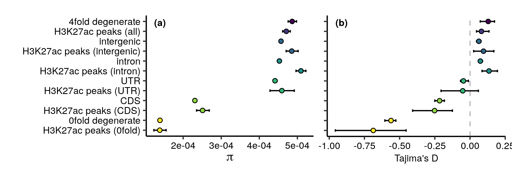

# Summary statistics from the uSFS data

```shell script
ls ../dfe/*_dfe_data.txt | python regional_stats.py -sel > summary_stats_sel_sites_usfs.csv
ls ../dfe/cds_dfe_data.txt | python regional_stats.py > summary_stats_neu_sites_usfs.csv
Rscript sum_stats_comp.R
```

